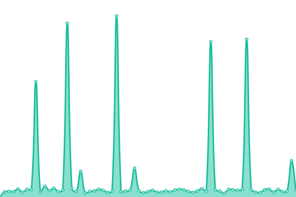

# [📈 Live Status](https://uptime.dennis.services): <!--live status--> **🟧 Partial outage**

This repository contains the open-source uptime monitor and status page for [Dennis Schuster](https://uptime.dennis.services), powered by [Upptime](https://github.com/upptime/upptime).

With [Upptime](https://upptime.js.org), you can get your own unlimited and free uptime monitor and status page, powered entirely by a GitHub repository. We use [Issues](https://github.com/Dennisschu/uptime/issues) as incident reports, [Actions](https://github.com/Dennisschu/uptime/actions) as uptime monitors, and [Pages](https://uptime.dennis.services) for the status page.

<!--start: status pages-->
<!-- This summary is generated by Upptime (https://github.com/upptime/upptime) -->
<!-- Do not edit this manually, your changes will be overwritten -->
<!-- prettier-ignore -->
| URL | Status | History | Response Time | Uptime |
| --- | ------ | ------- | ------------- | ------ |
|  [Ploen.social](https://Ploen.social) | 🟩 Up | [ploen-social.yml](https://github.com/Dennisschu/uptime/commits/HEAD/history/ploen-social.yml) | 

 704ms
     
 | 

<a href="https://uptime.dennis.services/history/ploen-social">100.00%</a>
    

|  [Ploen.social CDN](https://cdn.Ploen.social) | 🟩 Up | [ploen-social-cdn.yml](https://github.com/Dennisschu/uptime/commits/HEAD/history/ploen-social-cdn.yml) | 

 563ms
     
 | 

<a href="https://uptime.dennis.services/history/ploen-social-cdn">100.00%</a>
    

|  [Dennis.services Matrix](https://matrix.dennis.services) | 🟩 Up | [dennis-services-matrix.yml](https://github.com/Dennisschu/uptime/commits/HEAD/history/dennis-services-matrix.yml) | 

 989ms
     
 | 

<a href="https://uptime.dennis.services/history/dennis-services-matrix">100.00%</a>
    

|  [Dennis.services Mail](https://mail-1.dennis.services) | 🟩 Up | [dennis-services-mail.yml](https://github.com/Dennisschu/uptime/commits/HEAD/history/dennis-services-mail.yml) | 

 661ms
     
 | 

<a href="https://uptime.dennis.services/history/dennis-services-mail">100.00%</a>
    

|  [Teacup.social](https://teacup.social) | 🟥 Down | [teacup-social.yml](https://github.com/Dennisschu/uptime/commits/HEAD/history/teacup-social.yml) | 

 0ms
     
 | 

<a href="https://uptime.dennis.services/history/teacup-social">100.00%</a>
    

|  [Dennisschuster.eu Blog](https://Dennisschuster.eu) | 🟩 Up | [dennisschuster-eu-blog.yml](https://github.com/Dennisschu/uptime/commits/HEAD/history/dennisschuster-eu-blog.yml) | 

 147ms
     
 | 

<a href="https://uptime.dennis.services/history/dennisschuster-eu-blog">100.00%</a>
    

<!--end: status pages-->

[**Visit our status website →**](https://uptime.dennis.services)

## 📄 License

- Powered by: [Upptime](https://github.com/upptime/upptime)
- Code: [MIT](./LICENSE) © [Dennis Schuster](https://uptime.dennis.services)
- Data in the `./history` directory: [Open Database License](https://opendatacommons.org/licenses/odbl/1-0/)
